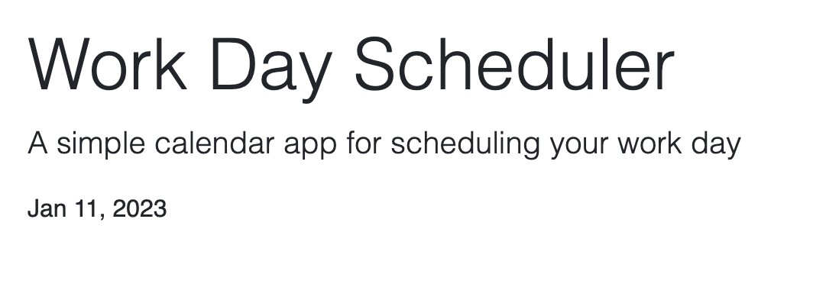
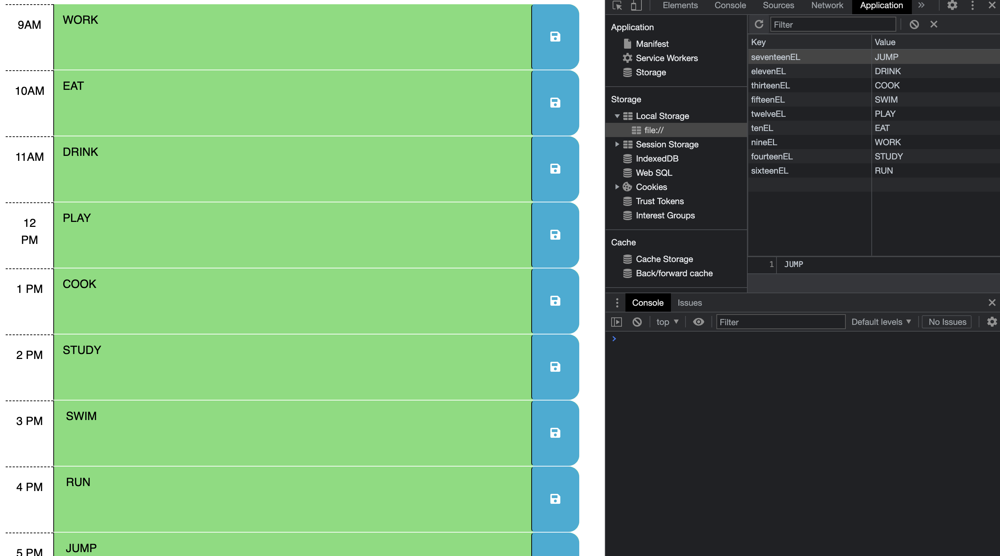

# 05 Third-Party APIs: Work Day Scheduler

## Description

- This project enables the audience to save events for each hour of the day. 

## Usage

- Audience can save events for each hour of the day. Each time block is color-coded to indicate whether it is in the past, present, or future. 

## Images

## deployed application

[application link] (https://jennyzzhh.github.io/Module-5-Third-Party-APIs-Challenge-Work-Day-Scheduler/)

[Github link] (https://github.com/Jennyzzhh/Module-5-Third-Party-APIs-Challenge-Work-Day-Scheduler.git)

